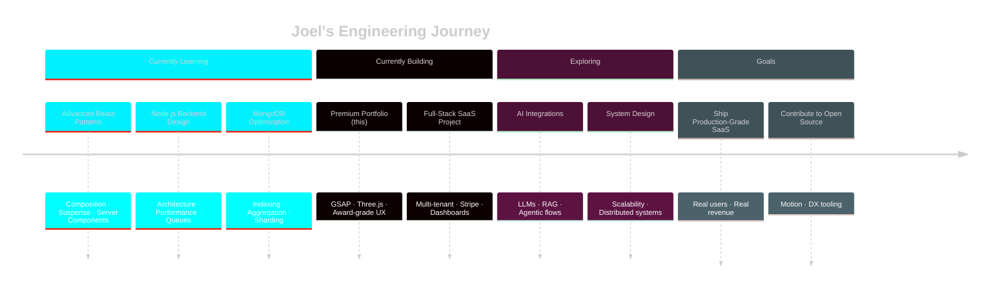

<div align="center">

<a href="https://github.com/Joel112003">
  
</a>

<br/>

<!-- TYPING ANIMATION -->
<a href="https://github.com/Joel112003">
  
</a>

<br/><br/>

<!-- PROFILE BADGES -->
<p>
  
  
  
</p>

<!-- CURRENTLY BUILDING -->
<p>
  
</p>

<!-- HERO CTA BUTTONS -->
<p>
  <a href="https://github.com/Joel112003"></a>
  &nbsp;
  <a href="mailto:joelkunjumon75@gmail.com"></a>
  &nbsp;
  <a href="https://www.linkedin.com/in/joelkunjumon"></a>
</p>

</div>

<!-- WAVE DIVIDER -->


<!-- ══════════════════════ ABOUT ME ══════════════════════ -->

<div align="center">

##  &nbsp; ABOUT ME

</div>

```ts
const joel = {
  role:        "Full-Stack MERN Engineer",
  focus:       ["Clean Architecture", "Motion-First UX", "Production-Grade Apps"],
  building:    ["SaaS Platforms", "Dashboards", "AI-Powered Tools"],
  stack:       ["React", "Node.js", "Express", "MongoDB", "GSAP", "Three.js"],
  philosophy:  "Pixel-precision frontends backed by systems that scale.",
  funFact:     "Lurks on Awwwards for inspo. Unwinds with Clash Royale."
};
```

<table>
  <tr>
    <td width="50%" valign="top">

> ### `> who_am_i.sh`
>
> I’m a **full-stack engineer** obsessed with the intersection of **engineering rigor** and **cinematic design**. I architect clean MERN systems, sweat the motion details with GSAP, and care deeply about how an app *feels* — not just what it does.

  </td>
  <td width="50%" valign="top">

> ### `> currently_focused.log`
>
> - 🚀 Shipping production-ready full-stack apps  
> - 🧩 Mastering scalable Node.js + MongoDB design  
> - 🎬 Pushing GSAP / Three.js to real-world UX  
> - 🤝 Collaborating on SaaS, dashboards, AI tools

  </td>
  </tr>
</table>

<br/>

<!-- ══════════════════════ TECH STACK ══════════════════════ -->

<div align="center">

##  &nbsp; TECH ARSENAL

<sub><i>Tools I reach for when shipping serious work</i></sub>

<br/><br/>

<!-- FRONTEND -->
<details open>
  <summary><b>🎨 &nbsp; FRONTEND &nbsp; · &nbsp; <code>UI · UX · MOTION</code></b></summary>
  <br/>
  
  <br/><br/>
  
  
  
  
</details>

<br/>

<!-- BACKEND -->
<details open>
  <summary><b>⚙️ &nbsp; BACKEND &nbsp; · &nbsp; <code>APIS · SERVICES · AUTH</code></b></summary>
  <br/>
  
  <br/><br/>
  
  
  
</details>

<br/>

<!-- DATABASE -->
<details open>
  <summary><b>🗄️ &nbsp; DATABASE &nbsp; · &nbsp; <code>PERSISTENCE</code></b></summary>
  <br/>
  
</details>

<br/>

<!-- ANIMATIONS / 3D -->
<details open>
  <summary><b>🎬 &nbsp; ANIMATION & 3D &nbsp; · &nbsp; <code>MOTION · IMMERSIVE</code></b></summary>
  <br/>
  
  
  
  
</details>

<br/>

<!-- DEVOPS / CLOUD -->
<details open>
  <summary><b>☁️ &nbsp; DEVOPS & CLOUD &nbsp; · &nbsp; <code>SHIP · SCALE</code></b></summary>
  <br/>
  
  <br/><br/>
  
  
</details>

<br/>

<!-- TOOLS -->
<details open>
  <summary><b>🛠️ &nbsp; TOOLS & WORKFLOW &nbsp; · &nbsp; <code>DAILY DRIVERS</code></b></summary>
  <br/>
  
</details>

</div>

<br/>

<!-- NEON DIVIDER -->
<div align="center">
  
</div>


<!-- ══════════════════════ FEATURED PROJECTS ══════════════════════ -->

<div align="center">

##  &nbsp; FEATURED PROJECTS

<sub><i>A curated selection — flagship builds, polished and live</i></sub>

</div>

<br/>

<!-- PROJECT 1 — EDIT: replace with real project -->
<table>
  <tr>
    <td width="40%">
      
    </td>
    <td width="60%" valign="top">

### `[01]` &nbsp; **PROJECT NAME — TAGLINE**

A premium full-stack platform delivering [core value]. Built with motion-first UX, real-time data, and a scalable Node backend.

**🧩 Tech** &nbsp;`React` `Node.js` `MongoDB` `GSAP` `TailwindCSS`  
**✨ Features** &nbsp;Real-time updates · JWT auth · Animated UI · Stripe payments

<p>
  
  
</p>

<a href="#"></a>
<a href="#"></a>

  </td>
  </tr>
</table>

<br/>

<!-- PROJECT 2 -->
<table>
  <tr>
    <td width="60%" valign="top">

### `[02]` &nbsp; **PROJECT NAME — TAGLINE**

An AI-powered [type] application with cinematic UX, intelligent automation, and a clean modular architecture.

**🧩 Tech** &nbsp;`Next.js` `Express` `MongoDB` `OpenAI` `Three.js`  
**✨ Features** &nbsp;AI integration · 3D visuals · Dashboard analytics · Multi-tenant

<p>
  
  
</p>

<a href="#"></a>
<a href="#"></a>

  </td>
    <td width="40%">
      
    </td>
  </tr>
</table>

<br/>

<!-- PROJECT 3 -->
<table>
  <tr>
    <td width="40%">
      
    </td>
    <td width="60%" valign="top">

### `[03]` &nbsp; **PROJECT NAME — TAGLINE**

A frontend-heavy interactive experience pushing GSAP + Three.js into a real-world product flow.

**🧩 Tech** &nbsp;`React` `GSAP` `Three.js` `TailwindCSS`  
**✨ Features** &nbsp;Scroll-driven motion · WebGL scenes · Optimized 60fps · Responsive

<p>
  
  
</p>

<a href="#"></a>
<a href="#"></a>

  </td>
  </tr>
</table>

<br/>

<div align="center">
  <a href="https://github.com/Joel112003?tab=repositories">
    
  </a>
</div>

<br/>

<!-- ══════════════════════ CURRENT FOCUS · ROADMAP ══════════════════════ -->

<div align="center">

##  &nbsp; CURRENT FOCUS & ROADMAP

</div>

<br/>



<br/>

<!-- ══════════════════════ GITHUB ANALYTICS ══════════════════════ -->

<div align="center">

##  &nbsp; GITHUB ANALYTICS

<br/>

<!-- UNIFIED CUSTOM THEME — cyan title / magenta icons / dark bg -->
<a href="https://github.com/Joel112003">
  
</a>
<a href="https://github.com/Joel112003">
  
</a>

<br/><br/>

<a href="https://github.com/Joel112003">
  
</a>
<a href="https://github.com/Joel112003">
  
</a>

<br/><br/>

<!-- CONTRIBUTION ACTIVITY GRAPH -->
<a href="https://github.com/Joel112003">
  
</a>

<br/><br/>

<!-- TROPHIES — unified dark theme -->
<a href="https://github.com/ryo-ma/github-profile-trophy">
  
</a>

</div>

<br/>

<!-- ══════════════════════ SNAKE ANIMATION ══════════════════════ -->

<div align="center">

###  &nbsp; CONTRIBUTION SNAKE

<picture>
  <source media="(prefers-color-scheme: dark)" srcset="https://raw.githubusercontent.com/platane/snk/output/github-contribution-grid-snake-dark.svg"/>
  <source media="(prefers-color-scheme: light)" srcset="https://raw.githubusercontent.com/platane/snk/output/github-contribution-grid-snake.svg"/>
  
</picture>

</div>

<br/>

<!-- ══════════════════════ DEV QUOTE ══════════════════════ -->

<div align="center">

##  &nbsp; QUOTE OF THE DAY

<a href="https://github.com/piyushsuthar/github-readme-quotes">
  
</a>

</div>

<br/>

<!-- ══════════════════════ NOW PLAYING / SPOTIFY ══════════════════════ -->

<div align="center">

##  &nbsp; CODING TO

<!-- EDIT: Replace `Joel112003` with your Spotify Connected user (see github.com/kittinan/spotify-github-profile) -->
<a href="https://open.spotify.com/">
  
</a>

<sub><i>Spotify widget — connect via <a href="https://github.com/kittinan/spotify-github-profile">spotify-github-profile</a></i></sub>

</div>

<br/>

<!-- NEON MATRIX DIVIDER -->


<!-- ══════════════════════ CONTACT ══════════════════════ -->

<div align="center">

##  &nbsp; LET’S CONNECT

<sub><i>Open to collaborations, freelance gigs, and product conversations</i></sub>

<br/><br/>

<a href="mailto:joelkunjumon75@gmail.com">
  
</a>
<a href="https://www.linkedin.com/in/joelkunjumon">
  
</a>
<a href="https://instagram.com/dietcokeesexual">
  
</a>
<a href="https://in.pinterest.com/Joel112003/">
  
</a>
<a href="https://leetcode.com/u/Joel2003/">
  
</a>
<a href="https://github.com/Joel112003">
  
</a>

<br/><br/>

<a href="mailto:joelkunjumon75@gmail.com">
  
</a>

</div>

<br/>

<!-- ══════════════════════ FOOTER ══════════════════════ -->

<div align="center">


<sub>
  <code>// system.exit(0)</code> &nbsp;·&nbsp; <code>signed, Joel Kunjumon</code> &nbsp;·&nbsp; <code>see you in the next deploy ↗</code>
</sub>

</div>
